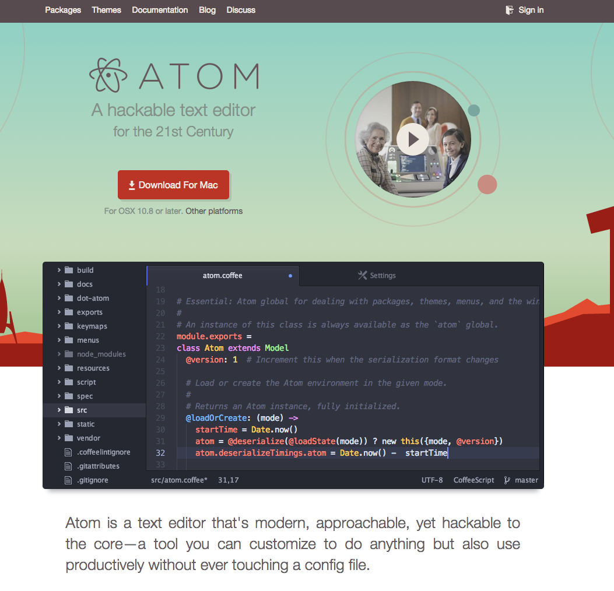
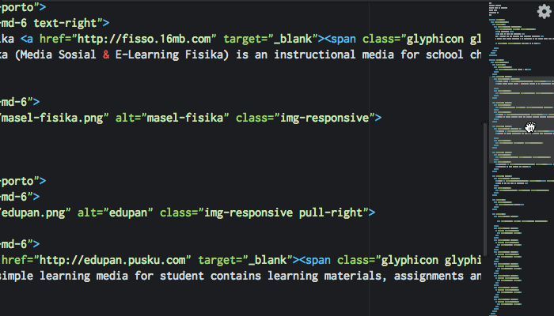
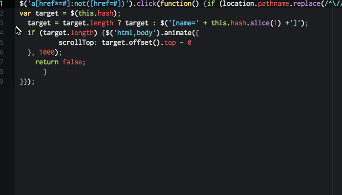

# A tutorial to setup a text editor on your system

####Why use a text editor?
A good text editor is a developer’s best friend. If you are not a developer you will soon be one. So, read on.

Unlike the default Notepad or TextEdit apps on Windows and OS X, coding-specific text editors help developers shortcut common tasks to program applications more quickly, follow web development standards and familiarize yourself with the tools/plugins.

This tutorial is to setup Atom and packages which will help in web development for the Design of Complex Websites course.


#### What is [Atom](https://atom.io)?

Atom is a text editor that's modern, approachable, yet hackable to the core—a tool you can customize to do anything but also use productively without ever touching a config file.

[Watch this short video to learn about Atom](https://www.youtube.com/watch?v=Y7aEiVwBAdk)

#### Reasons why we selected Atom:
- Easy to setup on all operating systems (Mac, Linux and Windows)
- A ton of easy to install packages
- Good looking themes which complement coding styles
- Endless customization possibilities
- Open Source

## Getting Started
### Contents
1. [Documentation](#1-documentation)
2. [Installation](#2-installation)
3. [Packages](#3-packages)

### 1. Documentation

If you want to read about using Atom or developing packages in Atom, the [Atom Flight Manual](https://atom.io/docs/latest/) is free and available online.

### 2. Installation



#### Install Atom on Mac OS X
- Go to the [Atom Website](https://atom.io/)
- Hit the download button
- Once you have the file, double click on it (extract the contents)
- Drag the new ````Atom```` application into the ````Applications```` folder.
- Open the new ````Atom```` application. You should see the text editor.

Atom will automatically update when a new release is available.

#### Install Atom on Windows
- Go to the [Atom Website](https://atom.io/)
- Hit the download button
- Once you have the file, run the installer
- This will install Atom, create shortcuts on the desktop and in the start menu, and also add an Open with Atom context menu in the Explorer
- Now, open the new ````Atom```` application. You should see the text editor.

Atom will automatically update when a new release is available.

#### Install Atom on Debian Linux (Ubuntu)

Currently only a 64-bit version is available.

1. Download `atom-amd64.deb` from the [Atom releases page](https://github.com/atom/atom/releases/latest).
2. Run `sudo dpkg --install atom-amd64.deb` on the downloaded package.
3. Launch Atom using the installed `atom` command.

The Linux version does not currently automatically update so you will need to
repeat these steps to upgrade to future releases.


### 3. Packages

With the right packages, you can be the most efficient coder. The following packages are great for web development and highly recommended. Atom makes it really easy to install packages which will help you write elegant, standards compliant code.

#### List of Packages
1. [Minimap](#minimap)
2. [Linter](#linter)
3. [Color Picker](#color-picker)
4. [JavaScript Snippets](#javascript-snippets)
5. [Highlight Line](#highlight-line)
6. [Atom Beautify](#atom-beautify)


To install the packages listed above you need to go do the following:
1. Go to Menu > Preferences
2. Select Packages from the left menu bar
3. Search for the package name
4. Click on install

Protip: ````command + ,```` on Mac and ````ctrl + ,```` on windows will open up the preference/settings panel

#### Minimap
---
- Description: A preview of the full source code.
- Install search term: ````minimap````
- Link: https://atom.io/packages/minimap



#### Linter
---
- Description: A Base Linter with Cow Powers
- Install search term: ````linter````
- Link: https://atom.io/packages/linter

##### Wondering what a linter is?
Linting is the process of checking the source code for Programmatic as well as Stylistic errors. This is most helpful in identifying some common and uncommon mistakes that are made during coding.

A Lint or a Linter is a program that supports linting (verifying code quality). They are available for most languages like JavaScript, CSS, HTML, Python, etc..

In Atom, there are available linters for JavaScript, CoffeeScript, CSS / SASS / SCSS / LESS / STYLUS, Ruby, Python.

After installing this main package, you need to install the specific linter for language you work on, for example if you are on JavaScript and choose JSHint for linter then you can install it from ````Preferences > Packages```` and searching for ````jshint````

Full list of linters: http://atomlinter.github.io/


#### Color Picker
---
- Description: Right click or press CMD-SHIFT-C/CTRL-ALT-C to open it.
- Install search term: ````color-picker````
- Link: https://atom.io/packages/color-picker


#### JavaScript Snippets
---
- Description: JavaScript & NodeJS Snippets for Atom
- Install search term: ````javascript-snippets````
- Link: https://atom.io/packages/javascript-snippets


#### Highlight Line
---
- Description: Highlights the current line in the editor
- Install search term: ````highlight-line````
- Link: https://atom.io/packages/highlight-line


#### Atom Beautify
---
- Description: Beautify HTML, CSS, JavaScript, PHP, Python, Ruby, Java, C, C++, C#, Objective-C, CoffeeScript, TypeScript, and SQL in Atom
- Install search term: ````atom-beautify````
- Link: https://atom.io/packages/atom-beautify



#### Credits
1. Atom.io Documentation
2. Package Repositories
