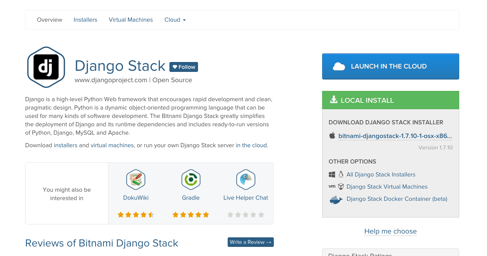
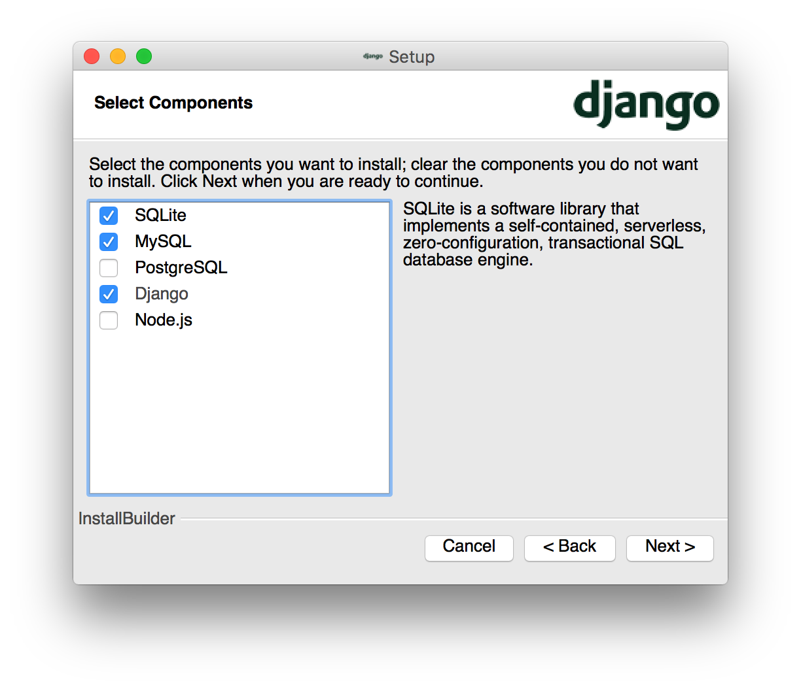
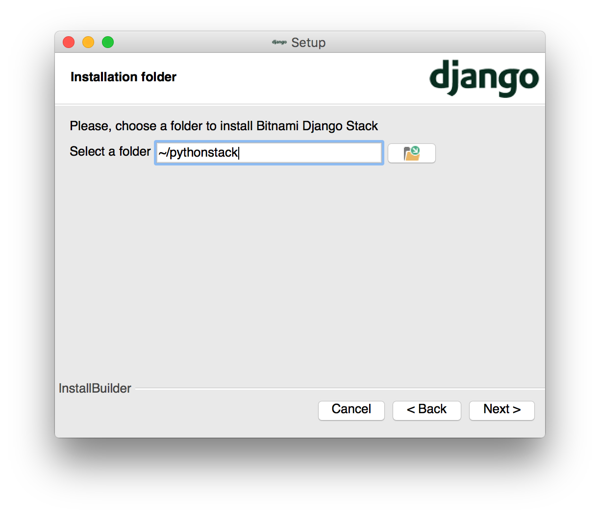
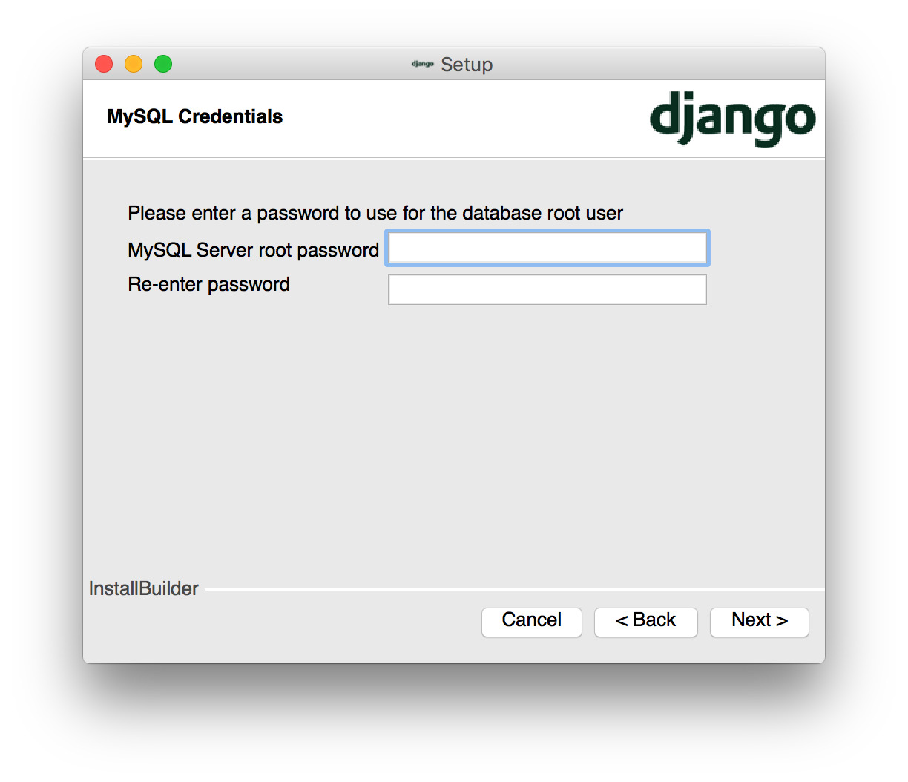
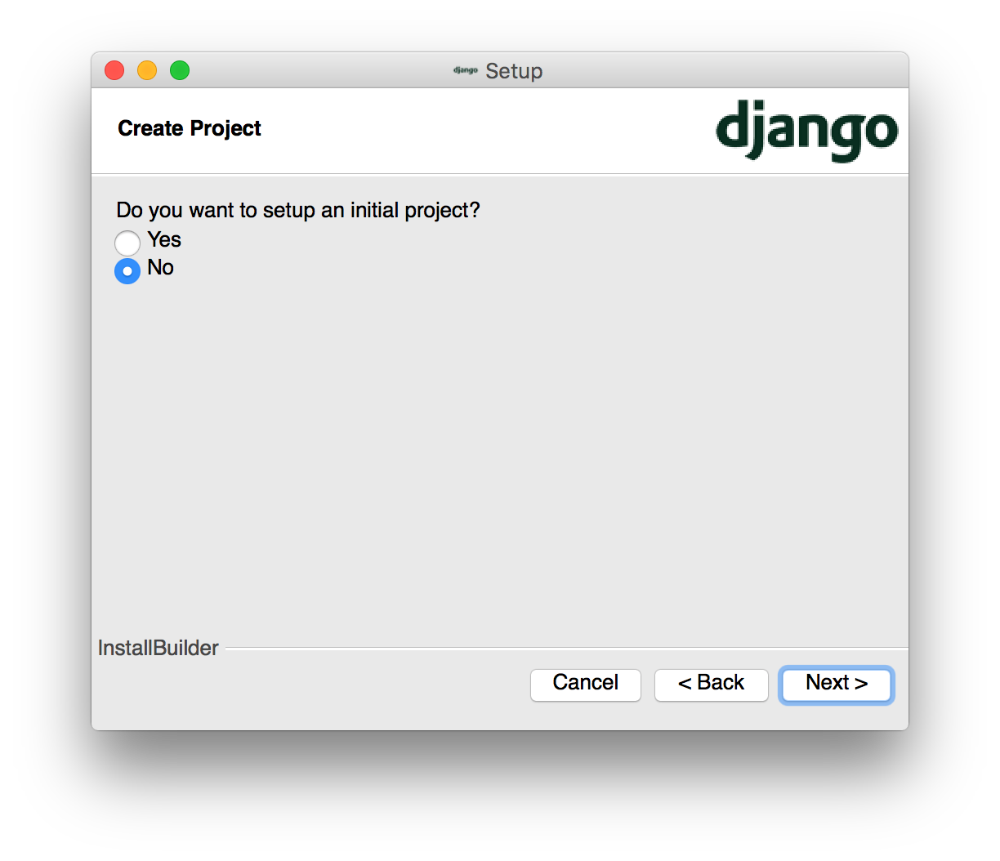
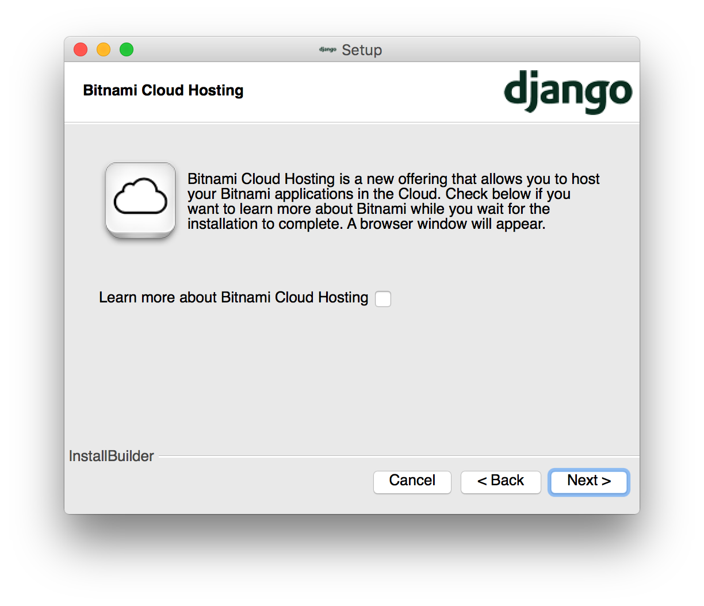
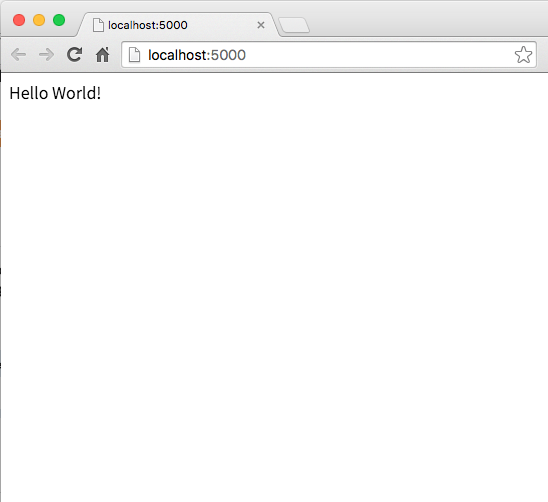

# Flask Setup Tutorial

## 1. Install [BitNomi](https://bitnami.com/)
### Step 1. Go to [https://bitnami.com](https://bitnami.com) and download **Django Stack**


### Step 2. Instll BitNomi
#### Just click next if any of the step is not mentioned in this section.
#### 1. Select Components
Django and (at least) one Database  

 
#### 2. Setup Installation Folder
We would suggest you to install it under your home folder, so type ```~/pythonstack``` for the folder path  


#### 3. Setup Password for your MySQL Server
You can just leave it blank right now.  


#### 4. Don't Create Project
Select **NO** here  


#### 5. Wait for Installation Completed
**[Caution]** The installation might take around 20 mins  


## 2. Start BitNomi and Install Flask for Mac (and probably Linux)
### Step 1. Open Terminal and Change to BitNami's directory
#### 1. Change the directory

```
$ cd ~/pythonstack
```

### Step 2. Run BitNami

```
$ ./use_djangostack
```
and you will see something like this shows up

```
bash-3.2$
```

### Step 3. Install Components
#### 1. Install PIP

```
$ easy_install pip
```

#### 2. Upgrade PIP

```
$ pip install --upgrade pip
```

#### 3. Install Flask

You would need to enter your computer's password here

```
$ sudo pip install Flask
```

## 3. Run the HelloWorld program
### Step 1. Make a working directory
Make sure you are inside the BitNami Environment, create a test folder and go into the folder

```
$ mkdir test
$ cd test
```

### Step 2. Create the Hello World file in your workind directory

#### 1. Open current folder in Finder

```
$ open .
```

#### 2. Create a text file named ```app.py```
Use your text editor (ex. Atom, Sublime, Vim ...) to create the hello world example. Save it under the test folder we just created.  
**[Important]** Indentation is very important in Python. Code without correct indentation might not work.

```
from flask import Flask
app = Flask(__name__)

@app.route("/")
def hello():
    return "Hello World!"

if __name__ == "__main__":
    app.run()
```

### Step 3. Run the Server and Test it
#### 1. Run the Server
Save the file and make sure it is in the test folder we just created.
In the terminal, type:

```
$ python app.py
```

You will see something like to indicate your server is running correctly.

```
 * Running on http://127.0.0.1:5000/ (Press CTRL+C to quit)
```

#### 2. Open it in the browser
In your browser's address line, type ```127.0.0.1:5000``` or ```localhost:5000```, and you should be able to see something like this.

