## Short tutorial on setting up Cyberduck and uploading a webpage to U of M webservers

#### Tool used: [Cyberduck](https://cyberduck.io/)

Once you download the Cyberduck application please follow the steps below:

###### What is Cyberduck?
###### Cyberduck is an open source client for FTP and SFTP, WebDAV, OpenStack Swift, and Amazon S3, available for Mac OS X and Windows (as of version 4.0) licensed under the GPL.

#### Step 1. Click "Open Connection"
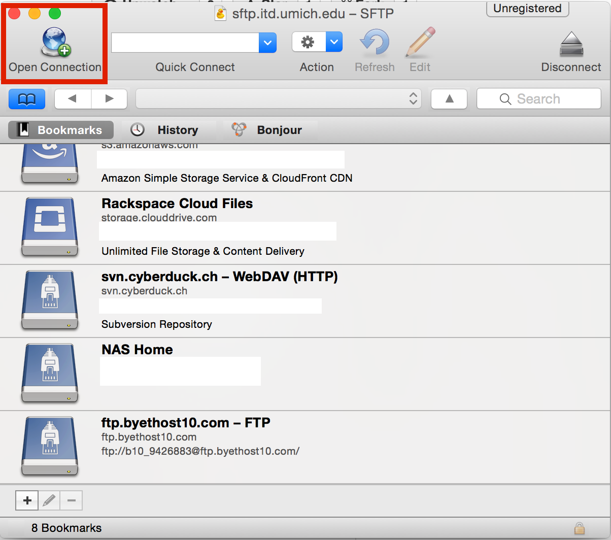

---

#### Step 2. Choose SFTP
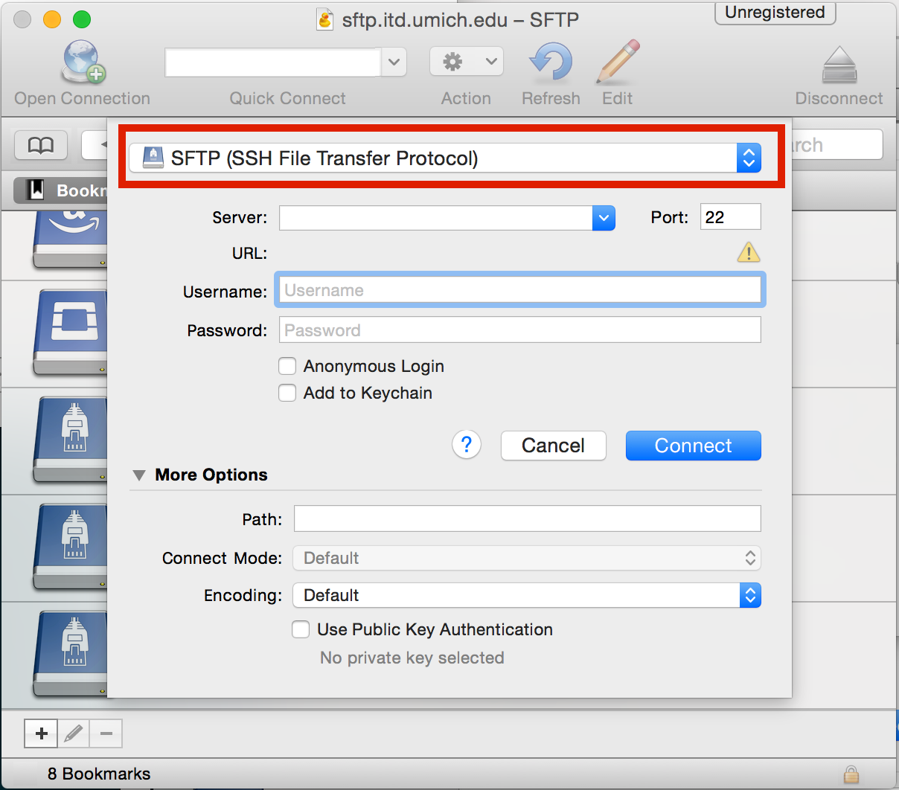

---

#### Step 3. Setup SFTP server information
1. In the server field, enter
``sftp.itd.umich.edu`` or ``people.si.umich.edu``
2. Port number is 22
3. In the username field, enter your uniqname
4. In the password field, enter your kerberos password
5. Click connect

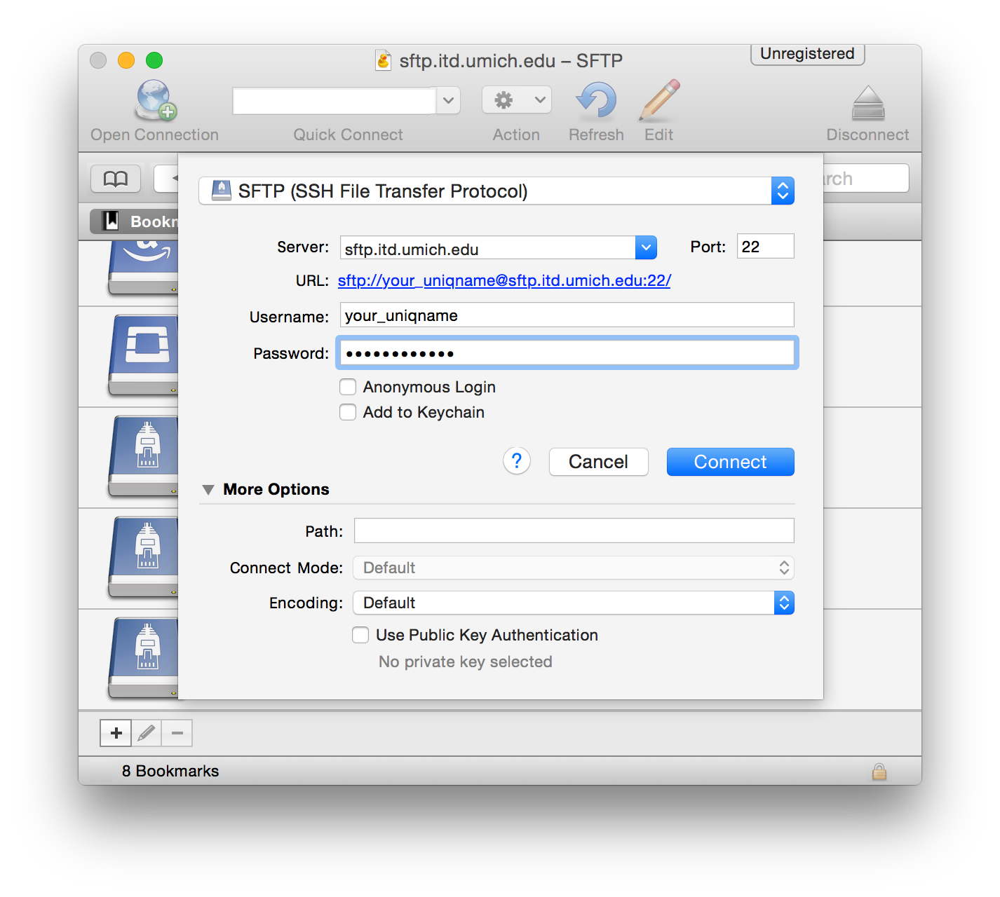

---

#### Step 4. If you successfully connected, you can see your file structure on the ftp server
Now you can drag and drop files to that window to upload your files, or double click files to download.

For example:
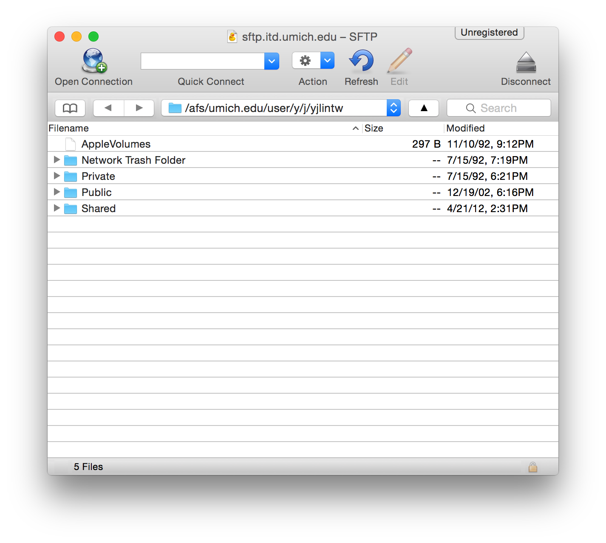

---

#### [Optional] Step 5. Add the ftp server to bookmark for quick access
1. Click the bookmark icon
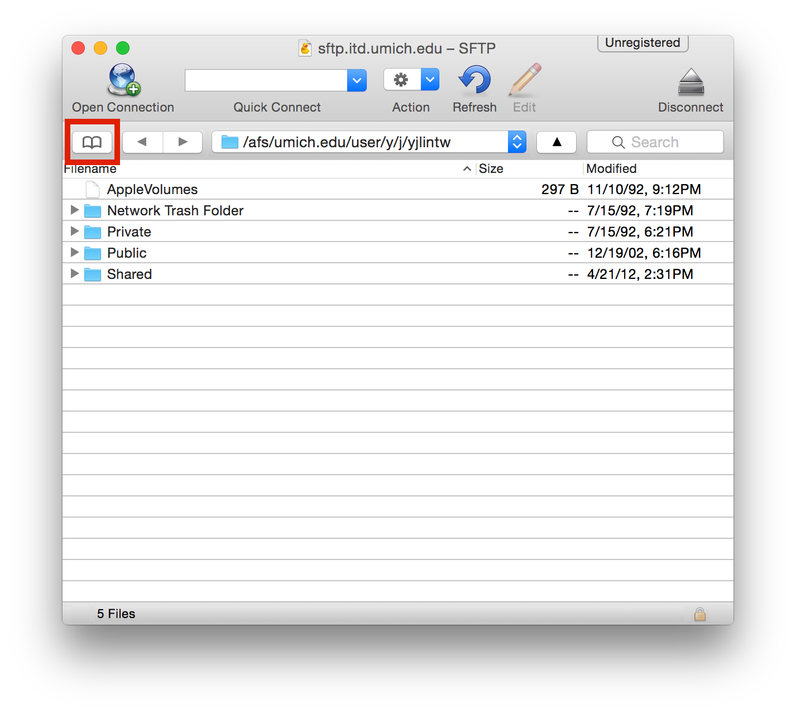

2. Everything should be filled correctly, if not just manually enter those fields
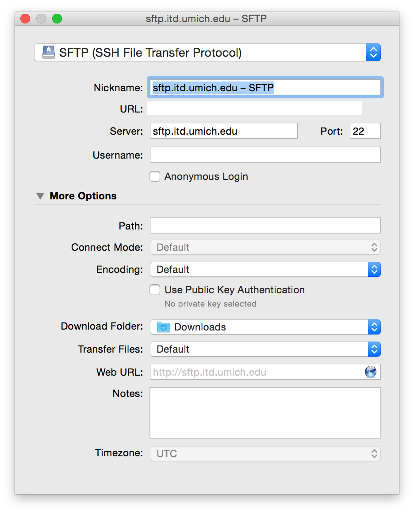

3. Close the window, and now the site is stored in your bookmark
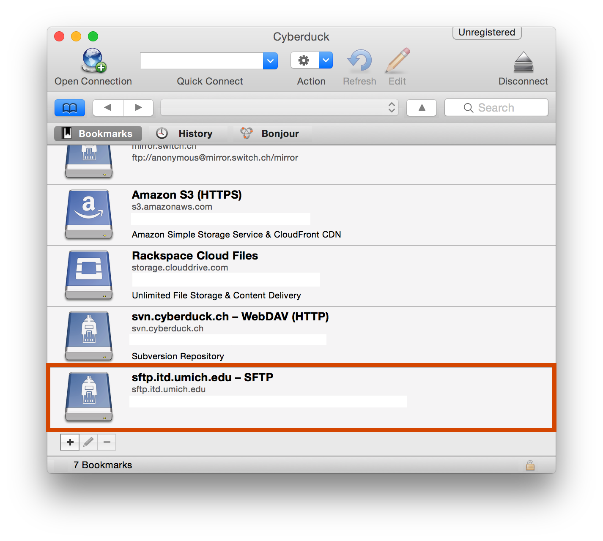

#### Step 6. Upload your webpage to the server
Let's take Week 1's discussion assignment for example  
1. I have file structure like this. I put the index.html file under the `dis1` folder and I put the picture inside the `dis1/pic/` folder.
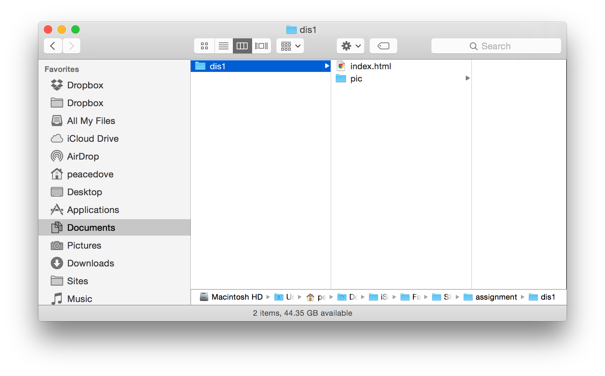

2. In Cyberduck, go to `Public/html`, there should be a default index.html already present
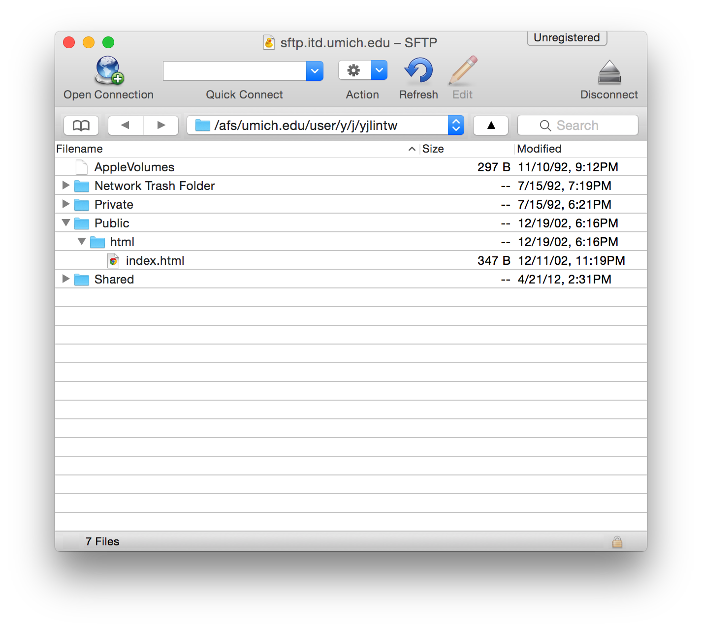

3. Drag your `ds1` folder on your computer to the `Public/html` folder on the server
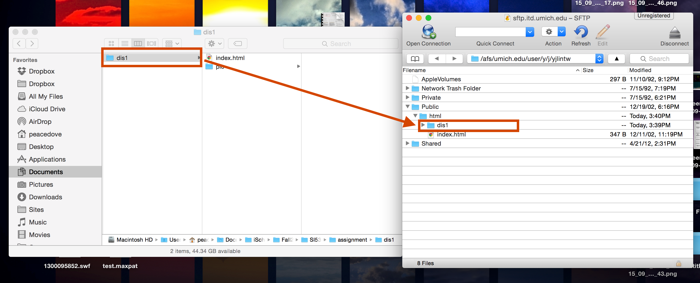

4. Open your browser and type the URL ````http://www-personal.umich.edu/~youruniqname/dis1/```` or ````http://youruniqname.people.si.umich.edu```` and you can see your webpage online
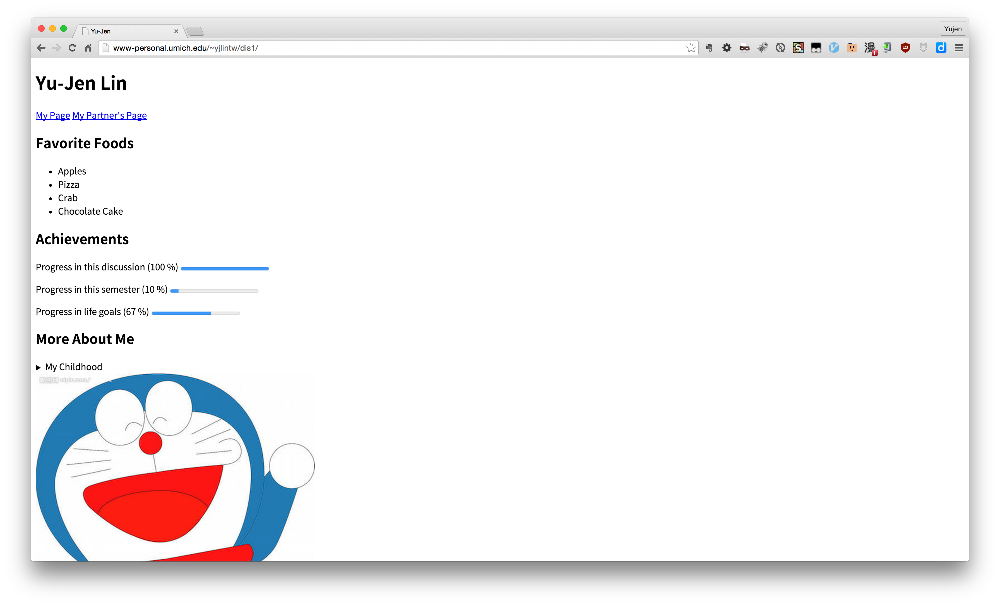
